# Estado do projeto — 2026-08-10

Replicação independente de Onoue et al. (ESEM'14, MSR'14, IEICE'16) sobre o dump MSR'14 do
GHTorrent (out/2013, 90 projetos). O pipeline roda do zero em máquina limpa e reproduz o próprio
`validation_report.md`. São 167 checks: **97 batem, 70 divergem** — todos declarados abaixo,
nenhum em aberto sem análise.

O achado central do IEICE'16 se sustenta: no agregado, prever crescimento por faixa etária erra
menos que a previsão ingênua (cohort 0,3894 < baseline 0,5000, p = 0,0124).

Este documento lista **só o que não bate**. Detalhe técnico de cada linha: `docs/discrepancias.md`.

## Como conferir qualquer número daqui

```bash
make setup DATASET_DIR=/caminho/absoluto   # sobe o banco a partir do dump
make run-all                               # pipeline inteiro, do zero
make validate                              # regera output/validation_report.md
make plots                                 # regera output/plots/
```

Cada item abaixo termina com **Conferir**, apontando três coisas: o `check` no
[`output/validation_report.md`](../output/validation_report.md) (é lá que estão os pares
esperado/obtido), o artefato que desenha o número e a seção de `docs/discrepancias.md` com o
comando SQL/Python que o produziu. Os artefatos ficam em [`output/plots/`](../output/plots/) e a
leitura em prosa de cada figura em [`docs/figuras/`](figuras/).

---

## 1. Distribuição dos Tipos A–D (IEICE16, Fig.5) — L1 = 9

| | A | B | C | D | classificados | sem contribuidor |
|---|---|---|---|---|---|---|
| artigo | 23 | 42 | 18 | 3 | 86 | 4 |
| replicação | 26 | 40 | 15 | 4 | 85 | 5 |

**Hipótese: o artigo usa uma definição de "newcomer" mais generosa que a nossa.** O desvio se
concentra em **4 projetos grandes que damos como A e o artigo dá como C** (§38.1); os pequenos
batem quase de graça. Empate de fronteira está descartado: há um vão vazio no NCR entre −0,25 e
+0,08, e fechar o gap exigiria reclassificar ~25-30% dos novatos como experientes. A causa mora na
definição de novato.

Refutados como causa: `age_basis` (§3, §19.5), largura de banda (§21), janela de morte por
silêncio (§38.3 — qualquer janela > 3 meses colapsa tudo em C+D), elegibilidade por população
viva (§38.4), desempate no zero (§35.3).

**Conferir:** `types.counts.A–D`, `types.total_classified`, `types.unclassified` no relatório ·
`output/plots/ieice16_fig5_2013-09-30.png` e `..._fig6_tipos_...png` · `docs/figuras/ieice16_fig5.md` ·
§3.1 e §38 de `discrepancias.md`.

## 2. `mojombo/jekyll` em 2011: artigo `terminal`, replicação `floating`

Os outros 4 projetos nomeados na Fig.2 do ESEM'14 batem (4/5).

**Hipótese: o mesmo viés do item 1.** Magnetismo é literalmente contagem de novatos sobre o total;
se classificamos novato demais, jekyll sai alto demais e sobe de terminal para floating. jekyll é o
projeto que mais cresceu no período (14 → 40 → 29 → 77 → 81 devs/ano), logo o mais exposto ao
critério de "primeira aparição". A nossa série reproduz a trajetória do artigo adiantada em um ano,
e o §13 mostra que o deslocamento é local ao jekyll, sem offset global. Hipótese da janela de ano
civil: descartada.

**Conferir:** `attractiveness.2011.79166` no relatório (os 4 que batem são `...79163`, `...104307`,
`...19786`, `...101472`) · `output/plots/msr14_fig2_2011.png` · §13 de `discrepancias.md`.

## 3. Tabela 2 do MSR'14 — 48/55 células (87%)

| ano | projeto | artigo | replicação | por quê |
|---|---|---|---|---|
| 2007 | `xbmc/xbmc` | attractive | floating | empate exato na mediana |
| 2009 | `xbmc/xbmc` | attractive | stagnant | empate exato na mediana |
| 2010 | `scala/scala` | floating | — | zero eventos de código em 2010 no dump |
| 2010 | `jquery/jquery` | floating | attractive | 5,1% da mediana |
| 2010 | `chriseppstein/compass` | floating | terminal | 4,6% da mediana |
| 2011 | `django/django` | attractive | stagnant | repo ainda não estava no GitHub |
| 2011 | `mojombo/jekyll` | terminal | floating | item 2 |

**Hipótese: desempate na mediana somado a buracos de cobertura do dump.** O método sai ileso: fora
da linha da mediana (margem > 10%) o acordo é 37/37. As 2 de margem 0,0% são o projeto que *define*
a mediana daquele ano — empate que o artigo resolve para o outro lado. `scala` e `django` são
buracos de dado, compatíveis com outro *vintage* do GHTorrent, que recompleta o passado a cada
coleta. As demais exigem correções contraditórias no mesmo eixo (`django` e `jquery` puxam
magnetismo em direções opostas), o que descarta uma correção sistemática única (§35.5).

**Conferir:** `msr14.tab2.concordancia` e as 55 linhas `msr14.tab2.<ano>.<projeto>` no relatório ·
`output/attractiveness/attractiveness.parquet` · §35 de `discrepancias.md`.

## 4. Projeção: 34 projetos elegíveis, o artigo diz 36

Corte ">100 contribuidores" aplicado sobre os ativos no snapshot base (2013-03-31). Dois projetos
ficam em cima da linha dos 100. Mexer no corte para chegar a 36 ajustaria o método ao resultado
(§12.3a), então mantivemos 34. Contagem travada por teste.

**Conferir:** `projection.n_projects` no relatório · `output/projection/projection.parquet` · §7 e §12.3a de
`discrepancias.md`.

## 5. Tabela 3 do IEICE'16 (ABRE célula a célula): 6 de 40 células dentro de ±2 p.p.

**Hipótese: a base é outra.** 34 projetos contra 36, coortes diferentes, e o ABRE de coortes
pequenas é dominado por ruído de ±1 pessoa. A comparação célula a célula é pouco conclusiva nos
dois sentidos, inclusive nas células que casaram.

**Conferir:** `projection.abre.*` (40 linhas) e a trava `replica_locks.projection_celulas_2pct` ·
`output/plots/ieice16_tab3_abre.csv` e `ieice16_tab3_tab4.md` · §12.5 de `discrepancias.md`.

## 6. Direção cohort × baseline: 14 de 20 pares batem

Erram: `A.non_coding`, `B.non_coding`, `B.moved` (empate), `B.coding`, `D.moved`,
`All.non_coding`.

**Hipótese: `non_coding` é a categoria doente.** É a única das quatro que inverte de sinal também
no agregado (artigo 0,5000 < 0,6667; replicação 0,5804 > 0,5000) e sem significância (p = 0,1145).
Mesma família de causa do item 5: coortes de discussão são as mais ralas.

**Conferir:** `projection.abre.*.direcao` e a trava `replica_locks.projection_direcao_pares` ·
`output/plots/ieice16_tab3_abre.csv` · §12.5 de `discrepancias.md`.

## 7. Significância (Wilcoxon, 20 recortes de faixa × categoria)

O artigo reporta significância em 16 dos 20; a replicação confirma **5** (`A.non_coding`, `C.moved`,
`All.moved`, `All.coding`, `All.all`). Em 2 ocorre o inverso — a replicação acha significância onde o
artigo não acha (`A.coding` p = 0,0003; `C.non_coding` p = 0,0216).

**Hipótese: poder estatístico.** n menor (34 projetos) e coortes ralas nas faixas altas. O sinal
existe e sobrevive no agregado, com força menor do que o artigo sugere: a vantagem da previsão por
faixa aparece no agregado e se dilui quando o recorte é isolado.

**Conferir:** `projection.wilcoxon.*` (20 linhas) no relatório ·
`output/plots/ieice16_tab4_wilcoxon.csv` · §12.1 de `discrepancias.md`.

## 8. Curto vs. longo prazo: ordem trocada

| | short | long | p |
|---|---|---|---|
| artigo | 0,4055 | 0,3333 | 0,0460 |
| replicação | 0,3363 | 0,4816 | 0,1768 |

**Hipótese: cauda longa rala.** Com janela 2010-2013 e 34 projetos, as bandas acima de ~4 anos têm
poucos contribuintes por coorte (n = 135/200) e o resultado fica dominado por ruído (§12.3c).

**Conferir:** `projection.term.direcao` e `projection.term.significancia` no relatório ·
`output/plots/ieice16_fig8_projecao_2013-09-30.png` · §12.3(c) de `discrepancias.md`.

## 9. Fig.2 do ESEM'14 (dez/2011), banda a banda: L1 = 411 pessoas

| painel | L1 |
|---|---|
| `mxcl/homebrew` | 363 |
| `thoughtbot/paperclip` | 38 |
| `clojure/clojure` | 11 |
| `joshuaclayton/blueprint-css` | 0 |

O resíduo é praticamente todo do homebrew, e a assinatura é exata: **+200 no lado do código, −129
no da discussão, +71 de população total**.

**Hipótese: a fronteira `coding` × `non_coding`.** 674 contribuidores vivos estão do lado do código
*só* por terem aberto pull request sem nenhum commit (601 nas 4 bandas mais novas, onde mora o
excesso) — o tamanho bate com a forma do erro, mas nenhuma regra testada recorta exatamente 129
desses 674.

Refutadas: âncora de idade (§33.1 — por construção ela só move gente entre bandas, mantendo cada um
do mesmo lado; o saldo −129/+200 fica idêntico), autoria do PR `user_id` × `actor_id` (§33.3a — 49
linhas divergentes em 13.171, mesma contagem de autores), "só PR mergeado conta como código"
(§33.3b — levaria o homebrew de +200 para −461), mais três hipóteses em §34. Sem hipótese testável
no momento.

**Conferir:** `output/plots/esem14_fig2_status_2011-12-31.png` contra a Fig.2 do artigo ·
tabela banda a banda em `docs/figuras/esem14_fig2.md` · §33 e §34 de `discrepancias.md`.

---

## Figuras lado a lado (artigo × réplica)

Recortes dos PDFs em `docs/papers/` à esquerda, nosso plot à direita. Mesma escala não é garantida;
o que se compara é forma e ordem.

| item | artigo | réplica |
|---|---|---|
| 1 — Tipos A–D (IEICE'16 Fig.5) | 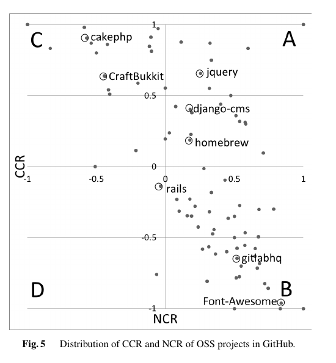 | 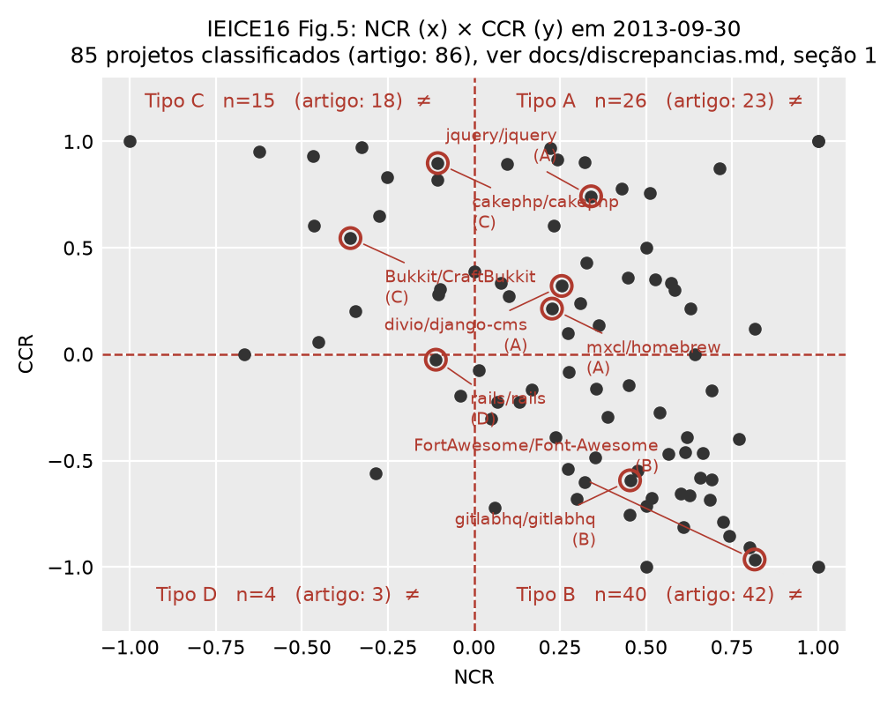 |
| 1 — pirâmides de exemplo (IEICE'16 Fig.6) | 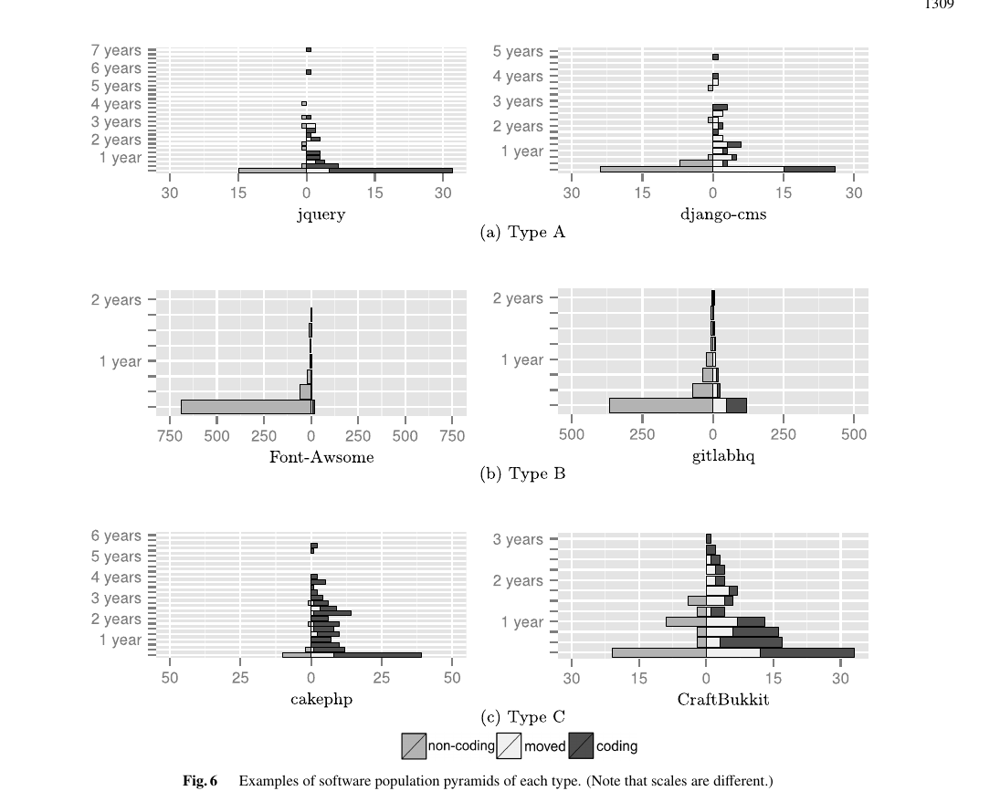 | 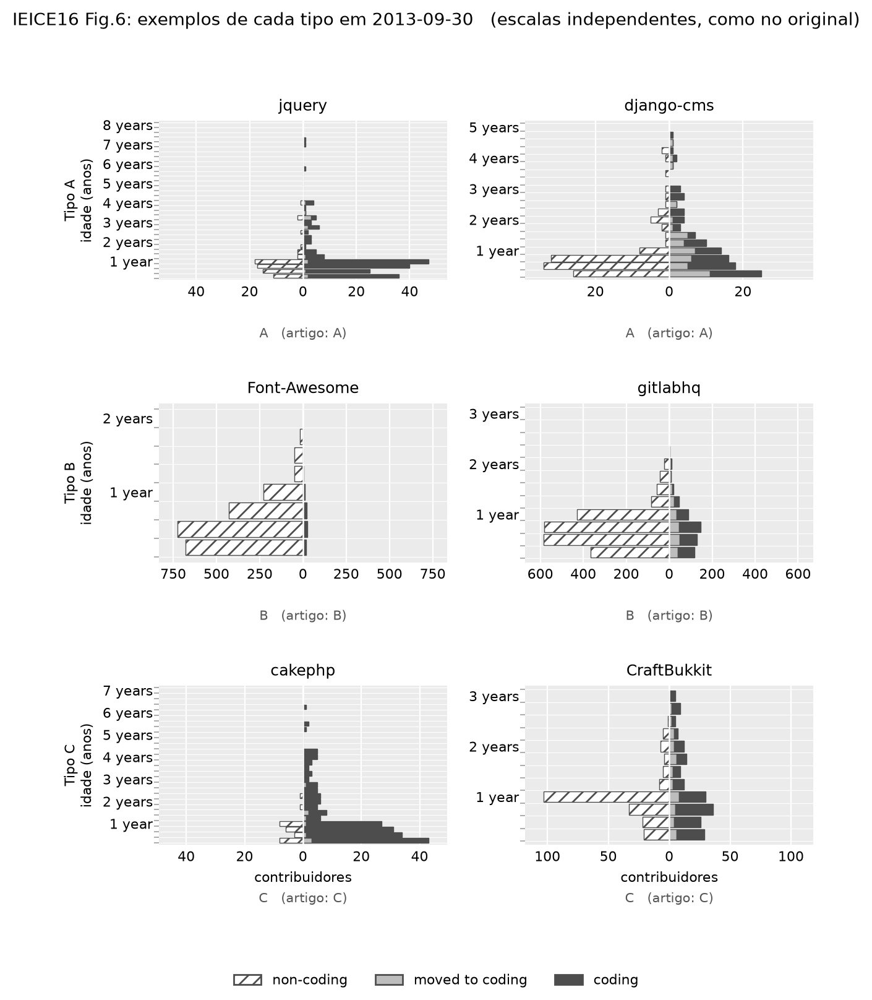 |
| 2 — magnet × sticky (MSR'14 Fig.2) | 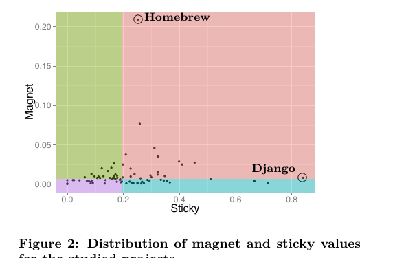 | 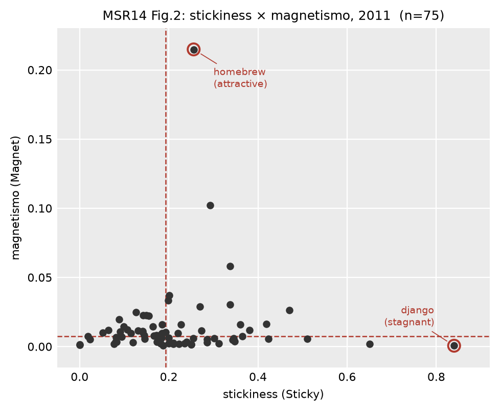 |
| 3 — transições de quadrante (MSR'14 Tab.2) | 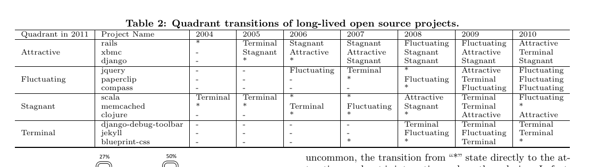 | `output/validation_report.md`, checks `msr14.tab2.*` |
| 8 — curto vs. longo prazo (IEICE'16 Fig.8) | 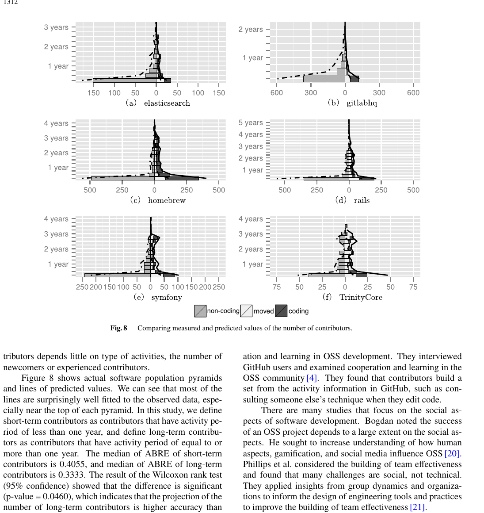 | 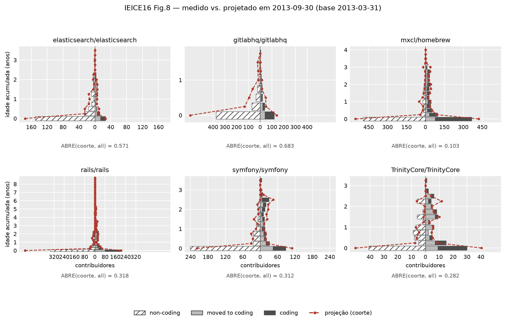 |
| 9 — pirâmide agregada (ESEM'14 Fig.2) | 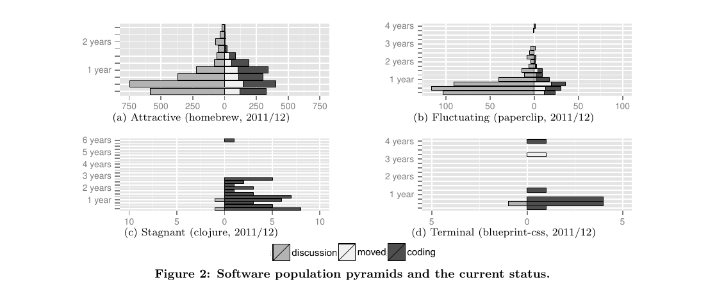 | 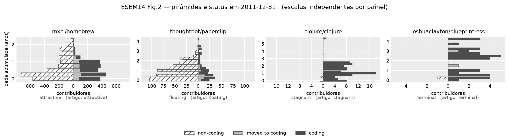 |

Os recortes são reproduzíveis: `make figuras-artigo` (usa `pdftoppm` a 150 dpi sobre
`docs/papers/{ESEM14,MSR14,IEICE16}.pdf`).

---

## O fio comum

1. **Classificamos novato demais.** Duas métricas independentes apontam o mesmo viés na mesma
   direção: sobra A e falta C nos tipos (item 1) e o magnetismo do jekyll sai alto (item 2). É a
   ambiguidade mais cara do trabalho e o artigo não fixa a definição em lugar nenhum do texto.
2. **Coortes ralas derrubam os recortes finos.** Itens 5, 6, 7 e 8 têm a mesma raiz: n pequeno,
   ABRE instável, significância que some fora do agregado.
3. **Buracos de cobertura do dump.** `scala/2010`, `django/2011` e provavelmente parte do resíduo
   do homebrew são compatíveis com um *vintage* diferente do GHTorrent, hipótese que o dump
   publicado não permite testar.

Nenhum dos nove itens derruba o achado principal; os itens 5-8 enfraquecem generalizações
secundárias do IEICE'16.
