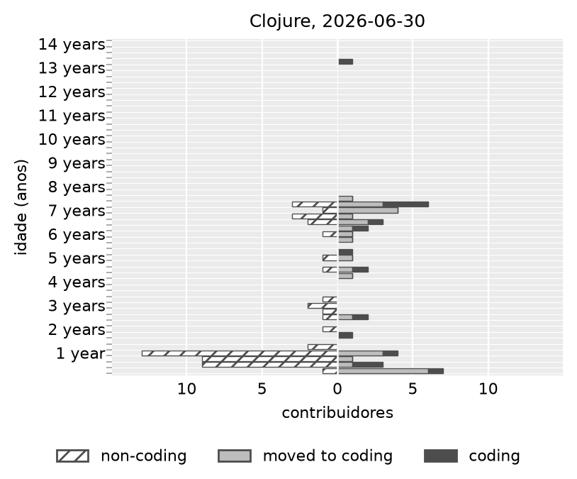

# Clojure: a pirâmide da linguagem

Saída da amostra de desenvolvimento, para conferência humana antes da coleta
grande. Reproduz com:

```bash
GHAPI_DIR=data/ghapi uv run python scripts/figuras_linguagem.py
```

Os números deste documento saem de `numeros.json`, gerado por esse comando.
Nenhum valor foi digitado à mão.

## A amostra

Três repositórios com Clojure como linguagem principal, escolhidos à mão:
`clj-kondo/clj-kondo`, `borkdude/edamame` e `weavejester/medley`. Eles somam um
escopo `Clojure` só.

| | |
|---|---|
| repositórios | 3 |
| eventos | 27.152 |
| contribuidores | 708 |
| primeiro evento | 2013-08-25 |
| último evento | 2026-08-21 |
| períodos de atividade (spans) | 1.184 |
| série de snapshots | 52 trimestres, 2013-09-30 a 2026-06-30 |

Eventos por tipo:

| tipo | quantidade |
|---|---|
| `issue_events` | 13.469 |
| `issue_comments` | 6.458 |
| `commits` | 3.282 |
| `issues` | 1.716 |
| `pull_requests` | 1.429 |
| `pull_request_comments` | 761 |
| `commit_comments` | 37 |

`issue_events` é metade da base. Ele já vem colapsado em 29,5% pela limpeza de
duplicata exata do contrato, porque rotular uma issue com três etiquetas gera
três eventos do mesmo ator no mesmo segundo.

## A pirâmide



O eixo vertical é a idade desde a primeira contribuição, em bandas de 3 meses.
O lado direito é quem escreve código, o esquerdo é quem só conversa, e o cinza
no meio é quem começou conversando e passou a codar.

A forma é a de uma comunidade que renova pela base. A banda de menos de 1 ano
carrega a maior parte da população dos dois lados, e acima de 8 anos só sobra um
contribuidor ativo: `weavejester` (id 8780), na banda 52, com 4.691 dias desde o
primeiro evento em 2013-08-25, que é a criação do `medley`. Ele é o dono do
repositório mais velho da amostra e a única pessoa daquela época que ainda
aparece.

## Os dois números de população, e por que diferem

| | janela | não-código | código |
|---|---|---|---|
| a figura desenha | 12 meses | 52 | 43 |
| o CCR e o NCR contam | 3 meses | 8 | 23 |

A diferença é declarada e medida. A figura usa
`plots.pyramid_window_months: 12`, fixado pela leitura em pixel da Fig.2 do
ESEM14: com snapshot em fim de período, "janela de 12 meses" quer dizer "quem
contribuiu durante o ano". As métricas usam `periods.inactivity_months: 3`, que
é onde o IEICE16 crava o número. Ver `discrepancias.md`, seções 19 e 40.

Quem olhar a figura e a tabela lado a lado precisa saber disso: são duas
populações diferentes do mesmo escopo.

## Os números do artigo, no snapshot de 2026-06-30

| medida | valor |
|---|---|
| contribuidores de código | 23 |
| contribuidores de não-código | 8 |
| novatos (banda 0, até 3 meses) | 8 |
| experientes (banda 1 ou mais) | 23 |
| CCR | +0,652 |
| NCR | -0,652 |
| tipo | **C** |

CCR e NCR seguem a fórmula do IEICE16 p.1308, com corte em zero e o `moved`
contando do lado de código.

**Tipo C** quer dizer mais código que conversa, e mais experiente que novato.
No IEICE16 são os projetos que a comunidade já consolidou: quem está lá escreve
código, e a renovação por baixo está fraca no trimestre.

## A série completa

52 snapshots trimestrais. Últimos oito:

| snapshot | código | não-código | novatos | experientes | CCR | NCR | tipo |
|---|---|---|---|---|---|---|---|
| 2024-09-30 | 22 | 23 | 14 | 31 | -0,043 | -0,548 | D |
| 2024-12-31 | 20 | 10 | 10 | 20 | +0,500 | -0,500 | C |
| 2025-03-31 | 14 | 12 | 6 | 20 | +0,143 | -0,700 | C |
| 2025-06-30 | 13 | 14 | 8 | 19 | -0,071 | -0,579 | D |
| 2025-09-30 | 20 | 19 | 17 | 22 | +0,050 | -0,227 | C |
| 2025-12-31 | 13 | 17 | 10 | 20 | -0,235 | -0,500 | D |
| 2026-03-31 | 16 | 15 | 12 | 19 | +0,062 | -0,368 | C |
| 2026-06-30 | 23 | 8 | 8 | 23 | +0,652 | -0,652 | C |

Distribuição dos 52 trimestres: C em 20, D em 12, A em 10, B em 10.

CCR mediano de +0,062 e NCR mediano de 0,000 na série inteira. A leitura: a
população de Clojure fica **em cima da linha de corte** quase o tempo todo, e o
tipo alterna entre C e D conforme o trimestre. O tipo de um único snapshot é
frágil para esta população, e o do último trimestre (+0,652) é o valor mais
extremo da série recente.

Isso é o mesmo modo de falha que o IEICE16 registra na Fig.7, onde `homebrew` e
`rails` ficam com CCR e NCR perto de zero e o quadrante vira sorte. Para uma
linguagem, olhar a série vale mais que olhar um snapshot.

## As outras linguagens da amostra

A coleta tem três repositórios Clojure, e o que aparece de outra linguagem são
os arquivos soltos dentro deles.

| linguagem | repositórios | eventos | pessoas | tipo |
|---|---|---|---|---|
| Clojure | 3 | 27.152 | 708 | C |
| Batchfile | 1 | 23 | 4 | sem ativo |
| Dockerfile | 1 | 20 | 6 | sem ativo |
| Java | 1 | 10 | 3 | sem ativo |
| Shell | 1 | 6 | 3 | C |
| Emacs Lisp | 2 | 4 | 2 | sem ativo |

As cinco últimas são ruído da amostra, e existem porque `outside_eligible: keep`
mantém o evento cujo caminho de arquivo aponta para uma linguagem que não é a
principal do repositório. Elas somem com `outside_eligible: drop`.

O escopo `unknown` recebe evento sem linguagem em repositório sem linguagem
detectada. Ele é contado e não vira figura, porque "unknown" não é uma
linguagem. Nesta amostra ele está vazio.

## O que não sai desta amostra, e por quê

Dois números do artigo não aparecem aqui. Os dois são limitação de tamanho de
amostra. O código roda; o que falta é escopo elegível suficiente para a
mediana e para o limiar significarem alguma coisa.

**Magnetismo e stickiness (MSR14 Tabela 2, Fig.2 e Fig.3).** O quadrante compara
o escopo com a mediana anual dos escopos elegíveis. Nesta amostra só Clojure
passa de `min_active_devs`, então a mediana é o próprio valor dele, o empate cai
do lado baixo, e os sete anos saem `terminal`. O magnetismo dá 1,0 por
construção, porque Clojure é o dataset inteiro. Medido rodando o estágio com a
trava removida.

**Projeção coorte-componente (IEICE16 Fig.8, Tabelas 3 e 4).** A elegibilidade é
mais de 100 contribuidores **ativos** no snapshot base. Clojure tem 708
contribuidores em treze anos e 31 ativos no snapshot da classificação, então
nenhum escopo é elegível e a projeção sai vazia.

Os dois voltam quando a amostra tiver várias linguagens acima do corte. A trava
está em `UNIDADES`, no topo de `attractiveness.py` e de `projection.py`, com o
motivo escrito.

## O que conferir nesta validação

1. A forma da pirâmide bate com a de uma comunidade que renova pela base.
2. Os 708 contribuidores e os 27.152 eventos batem com a coleta.
3. CCR e NCR do snapshot batem com a tabela, lembrando que a figura usa janela
   de 12 meses e a métrica usa 3.
4. `borkdude` aparece uma vez só. Ele está nos três repositórios, com primeiro
   evento em 2019-02-04 no `medley`, e é essa a data que vale. Sob
   `unit: project` ele seria três pessoas, a mais nova estreando em agosto.
5. O tipo do último snapshot é C, e a série mostra que ele alterna com D.
