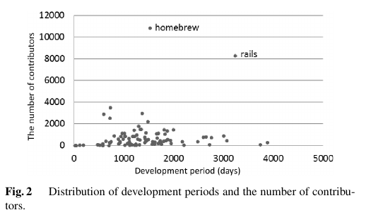
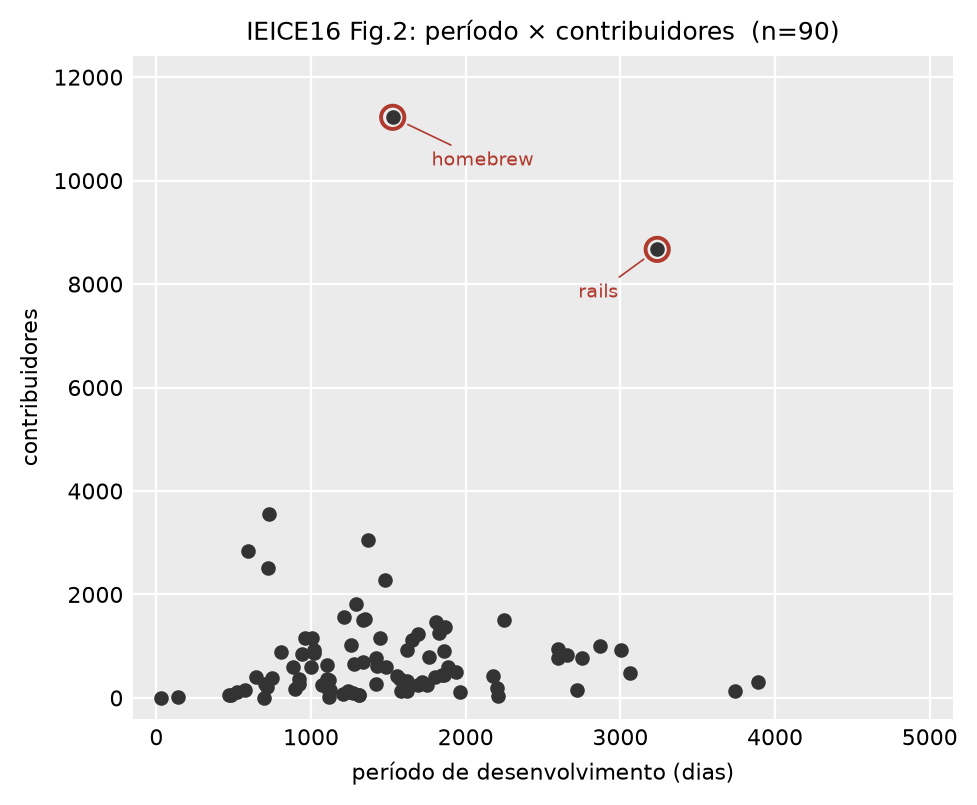

# IEICE 2016: Figura 2

**Arquivo gerado:** `output/plots/ieice16_fig2.png`
**Comando:** `pyramid plot --figure period-scatter`
**Conferir os números:** `output/plots/ieice16_fig2.csv` traz um projeto por
linha, com período e contribuidores. É o mesmo dado que virou desenho.

## O que a figura mostra

Os 90 projetos do estudo em um gráfico de dispersão, um ponto por projeto, sem
recorte de data.

O eixo horizontal é o período de desenvolvimento em dias, do primeiro ao último
evento do projeto. O vertical é quanta gente contribuiu no período todo. A figura
existe para mostrar que a amostra tem projeto novo e projeto velho, pequeno e
grande.

| artigo | replicação |
|---|---|
|  |  |

## O que saiu igual

- **O período de desenvolvimento bate dentro de um pixel** nos dois projetos que
  o artigo nomeia. Um pixel da figura publicada vale 14 dias.
- **A forma da nuvem:** massa entre 500 e 2.000 dias abaixo de 4.000
  contribuidores, homebrew sozinho no alto, rails à direita dele, meia dúzia de
  projetos além dos 2.500 dias e dois colados no zero.
- **O total de projetos: 90**, igual ao artigo.
- **A régua dos eixos** é a da figura publicada, 5.000 dias e 12.000 pessoas.

## O que saiu diferente

| projeto | grandeza | artigo | replicação | diferença |
|---|---|---|---|---|
| homebrew | período | 1.525 d | 1.528 d | +0,2 % |
| rails | período | 3.220 d | 3.238 d | +0,6 % |
| homebrew | contribuidores | 10.829 | 11.224 | +3,7 % |
| rails | contribuidores | 8.195 | 8.671 | +5,8 % |

## Por que isso acontece

O período casa dentro do erro de leitura, o que fecha três perguntas de uma vez:
é o mesmo dump, é a mesma janela de tempo, e "período de desenvolvimento" é mesmo
do primeiro ao último evento, sem recorte por snapshot.

Os contribuidores saem de 4 % a 6 % acima, e o sinal é o esperado da duplicação de
identidade: o GHTorrent abre uma linha em `users` por identidade que consegue
resolver, e a mesma pessoa costuma ter uma conta cheia mais satélites de poucos
eventos. Com `identity_merge: none` cada satélite conta como gente. O homebrew tem
291 grupos por nome completo.

Esta é a figura de controle da replicação: ela mede data e gente, não evento. É
por ela que se sabe que o déficit da Fig. 3 é de contagem de commit, e não falta
de dado.

Detalhamento, com a calibração em pixel e os comandos:
`docs/replicacao/discrepancias.md`, seção 39.2.
