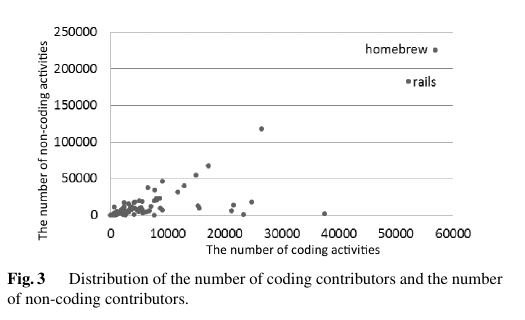
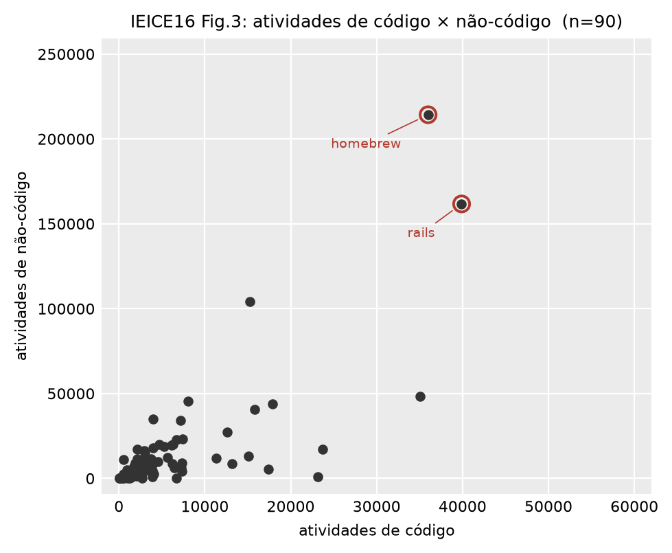

# IEICE 2016: Figura 3

**Arquivo gerado:** `output/plots/ieice16_fig3.png`
**Comando:** `pyramid plot --figure activity-scatter`
**Conferir os números:** `output/plots/ieice16_fig3.csv` traz um projeto por
linha, com atividade e contribuidor dos dois lados. É o mesmo dado que virou
desenho.

## O que a figura mostra

Os 90 projetos do estudo em um gráfico de dispersão, um ponto por projeto, sem
recorte de data: conta tudo que o dump tem.

O eixo horizontal é a atividade de código do projeto (commit e pull request). O
vertical é a atividade de não-código (comentário de commit, comentário de issue,
comentário de pull request e evento de issue). A figura existe para mostrar que a
amostra tem projeto de todo tamanho, do muito pequeno ao homebrew.

| artigo | replicação |
|---|---|
|  |  |

## O que saiu igual

- **A forma da nuvem:** massa densa colada na origem, dois projetos soltos no
  canto superior direito com homebrew acima de rails, e dois pontos
  intermediários isolados no meio do gráfico.
- **Os dois projetos que o artigo nomeia dentro do gráfico** são os dois pontos
  extremos aqui também.
- **O total de projetos: 90**, igual ao artigo.
- **A régua dos eixos** é a da figura publicada, 60.000 em x e 250.000 em y.

## O que saiu diferente

O lado de código fica baixo nos dois projetos nomeados, medindo o artigo em
pixel:

| projeto | eixo | artigo | replicação | diferença |
|---|---|---|---|---|
| homebrew | não-código | 224.727 | 214.252 | -4,7 % |
| rails | não-código | 181.694 | 161.700 | -11,0 % |
| homebrew | código | 56.847 | 35.991 | -36,7 % |
| rails | código | 52.117 | 39.891 | -23,5 % |

## Por que isso acontece

A legenda do artigo diz "number of coding contributors and the number of
non-coding contributors", e os rótulos dos eixos da figura publicada dizem
"activities". A régua decide: nenhum dos 90 projetos tem 60 mil contribuidores, e
o mais populoso tem 11.224. A figura conta atividade, e é atividade que esta
replicação desenha.

O déficit do lado de código é escopo de commit. `commits.project_id` é o projeto
onde o commit foi REGISTRADO, e o contribuidor externo commita no fork dele e abre
pull request, então o commit chega ao projeto por `project_commits`. Contar só a
raiz descarta a via principal de contribuição, e descarta mais em quem recebe mais
pull request. Medido nos dois projetos nomeados:

| leitura de "commit do projeto" | homebrew | rails |
|---|---|---|
| raiz mais pull requests abertos (em vigor) | -36,7 % | -23,5 % |
| família da raiz, sem repetir commit, mais pull requests abertos | +3,5 % | +2,4 % |

Trocar `commit_scope` mexe em todo o pipeline, então a decisão é PR própria, com o
protocolo de cinco passos.

O lado de não-código fica aberto: `prose` erra -4,7 % e -11,0 %, `union` erra +6,0 %
e -3,7 %, e dois projetos publicados não decidem entre as duas. Volta a ser
mensurável depois que o escopo de commit estiver resolvido, porque
`commit_comments` também é atrelado a `commits.project_id`.

A Fig. 2 do mesmo artigo serve de controle e mostra que não falta dado: o período
de desenvolvimento bate dentro de um pixel nos dois projetos (1.528 dias contra
1.525 lidos no homebrew, 3.238 contra 3.220 no rails).

Detalhamento, com a calibração em pixel e os comandos:
`docs/replicacao/discrepancias.md`, seção 39.
