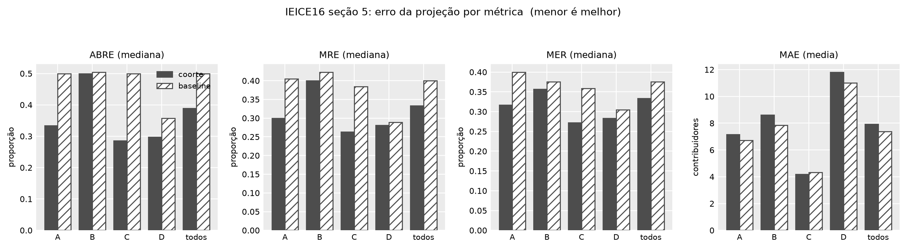

# IEICE 2016: as quatro métricas de erro da projeção

**Arquivo gerado:** `output/plots/ieice16_metricas_de_erro.png`
**Comando:** `pyramid plot --figure error-metrics`
**Conferir os números:** `output/plots/ieice16_metricas_de_erro.csv` traz tipo,
categoria e métrica por linha, com coorte e baseline lado a lado.

## O que a figura mostra

A seção 5 do artigo define três métricas de erro (p.1311, citando Miyazaki et
al.) e publica só a mediana do ABRE, na Tabela 3. Esta figura desenha as quatro
lado a lado, um painel por métrica, por tipo de projeto, na população `all`:

- **ABRE**, `|x - x̂|` sobre o MENOR entre medido e predito, que é o que a Tabela 3 traz;
- **MRE**, sobre o MEDIDO;
- **MER**, sobre o PREDITO;
- **MAE**, o erro absoluto médio, em contribuidores.

As três relativas vão por mediana, como o artigo faz. O MAE vai por média, que é
o que o "M" quer dizer.

## O que ela responde

A conclusão do artigo é que a projeção por coorte erra menos que o baseline
ingênuo. Ela se sustenta nas três métricas relativas, em todos os tipos, e
**inverte no MAE** em A, B, D e no agregado.

| métrica | agregado (coorte) | agregado (baseline) | quem ganha |
|---|---|---|---|
| ABRE | 0,389 | 0,500 | coorte |
| MRE | 0,333 | 0,400 | coorte |
| MER | 0,333 | 0,375 | coorte |
| MAE | 7,93 | 7,38 | baseline |

A leitura é direta: erro relativo normaliza pela coorte, e coorte pequena domina
a mediana. Erro absoluto é dominado pelas bandas grandes, que é onde a projeção
por coorte erra em número de pessoas. As duas coisas são verdade ao mesmo tempo,
e o artigo publica só a primeira.

Nenhuma trava nova entrou: só o ABRE tem contraparte publicada, e as outras três
saem do mesmo parquet que ele, já travado.

Detalhamento: `docs/replicacao/discrepancias.md`, seção 42.
