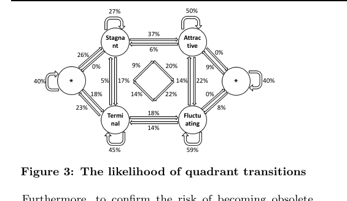
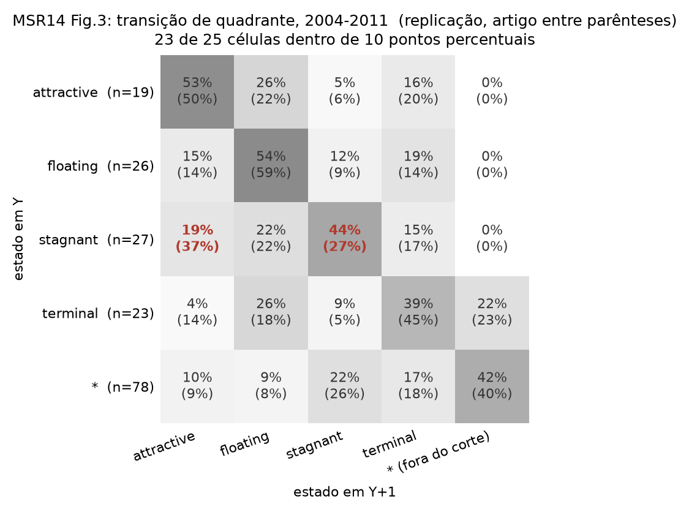

# MSR 2014: Figura 3

**Arquivo gerado:** `output/plots/msr14_fig3_transicoes_2004_2011.png`
**Comando:** `pyramid plot --figure quadrant-transitions`
**Conferir os números:** `output/plots/msr14_fig3_transicoes_2004_2011.csv` traz
origem, destino, replicação, artigo, diferença em pontos e o número de
transições observadas.

## O que a figura mostra

Com que frequência um projeto muda de quadrante de um ano para o outro. Cinco
estados: os quatro quadrantes (attractive, floating, stagnant, terminal) e o `*`,
que é o projeto existindo e pequeno demais para ser classificado (dez
desenvolvedores ativos ou menos). Janela 2004-2011, a mesma da Tabela 2.

O artigo desenha isso como diagrama de estados, com 20 setas rotuladas. A
replicação sai como matriz, porque o conteúdo é o mesmo e a comparação célula a
célula fica direta.

| artigo | replicação |
|---|---|
|  |  |

## O que saiu igual

- **23 das 25 células** caem dentro de 10 pontos percentuais.
- **"Terminal é o único que cai no estado filtrado":** a afirmação central do
  artigo reproduz exata. Só `terminal` tem seta para o `*` (22 % contra 23 % do
  artigo); attractive, floating e stagnant dão 0 %, como no diagrama.
- **A auto-transição é sempre o destino mais provável** nos quatro quadrantes, e
  na mesma ordem: floating e attractive seguram mais que terminal e stagnant.
- **As duas exceções que o artigo nomeia** ("projects are more likely to
  transition from the lower quadrant to the higher one") aparecem nas mesmas duas
  duplas: stagnant para attractive (19 % contra 5 % na volta) e terminal para
  floating (26 % contra 19 %).
- **Floating se espalha parecido** pelas outras três categorias (15 %, 12 %,
  19 %), que é a leitura que o artigo faz da figura dele (14 %, 9 %, 14 %).

## O que saiu diferente

Duas células, as duas da linha do stagnant:

| transição | artigo | replicação | diferença |
|---|---|---|---|
| stagnant → attractive | 37 % | 19 % | -18 pontos |
| stagnant → stagnant | 27 % | 44 % | +17 pontos |

## Por que isso acontece

É uma divergência só, vista de dois lados: o projeto estagnado da replicação
tende a **continuar** estagnado, e no artigo ele tende a virar atrativo. A soma
das duas células é praticamente a mesma (63 % contra 64 %), então não é gente
sumindo: é a mesma população indo para outro lado.

O sentido bate com o que a seção 13 já mostrou no jekyll e a seção 38 nos Tipos
A-D: a replicação é mais conservadora para promover projeto a atrativo, porque
mede magnetismo com o denominador de novatos do dataset inteiro. Quem está na
fronteira do magnetismo mediano fica do lado de baixo aqui e do lado de cima no
artigo.

Detalhamento, com a decodificação dos rótulos do diagrama:
`docs/replicacao/discrepancias.md`, seção 44.
